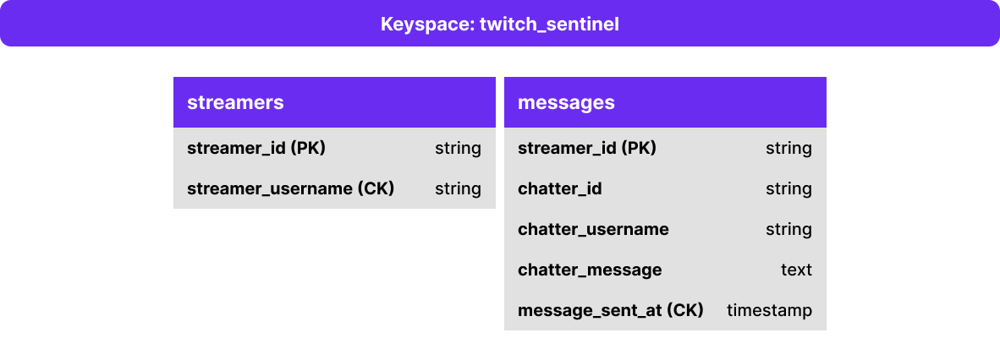
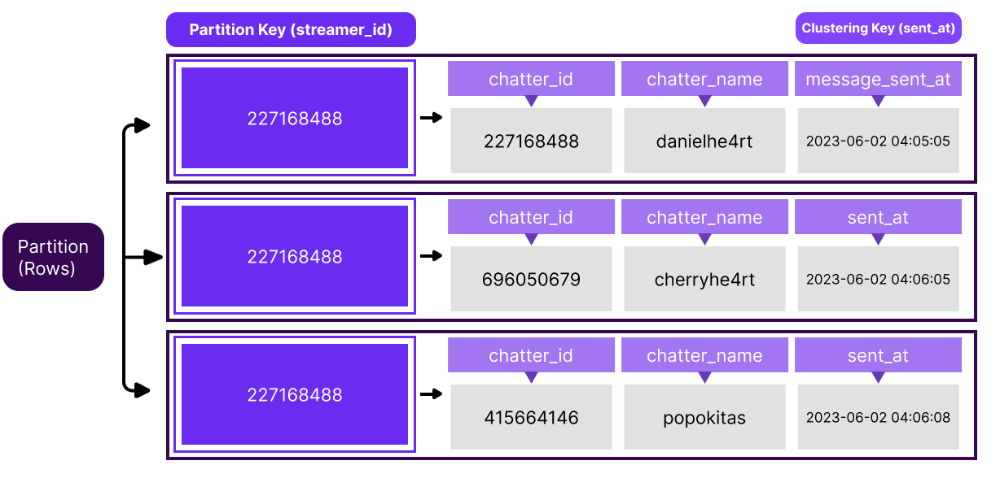

A Keyspace is a top-level container that stores tables with attributes that define how data is replicated on nodes. It defines several options that apply to all the tables it contains, the most important of which is the replication strategy used by the Keyspace. A keyspace is comparable to the concept of a Database Schema in the relational world.  

Since the keyspace defines the replication factor of all underlying tables, if we have tables that require different replication factors, we would store them in different keyspaces.
Create a keyspace and call it **twitch_sentinel**:

`CREATE KEYSPACE twitch_sentinel WITH REPLICATION = { 'class' : 'NetworkTopologyStrategy', 'replication_factor' : 3};`{{execute}}

and then to use the keyspace that we created you need to run: 

`use twitch_sentinel;`{{execute}}

> You need to be inside the CQLSH to run those commands.

Now we're good to go and create our tables and start developing our software!

## Modeling our First Tables



Twitch Sentinel has one task: retrieve and store messages from any twitch channel that we want. But what do we need to make it work?

At the beginning, we will need two tables:

- streamers
- messages

We will add more tables, but let's keep it simple.

`
CREATE TABLE streamers (
   streamer_id text,
   streamer_username text,
   PRIMARY KEY (streamer_id)
);
`{{execute}}

`CREATE TABLE messages (
   streamer_id text,
   chatter_id text,
   chatter_username text,
   chatter_message text,
   message_sent_at timestamp,
   PRIMARY KEY (streamer_id, message_sent_at)
) WITH CLUSTERING ORDER BY (message_sent_at DESC);`{{execute}}

The `streamers` table will store all twitch channels `id/usernames` that we want to connect and listen the chat and `messages` table will store all the messages from those channels.


After created we can run the `DESC table_name;` to see if is everything working as expected.

`DESC streamers;`{{execute}}

`DESC messages;`{{execute}}


## Inserting Data



Before add any streamer into our app, let's do a quick start. If you have a Twitch Channel, add it changing the query below: 

```sql
INSERT INTO streamers (streamer_id, streamer_username) VALUES ('227168488', 'danielhe4rt');
INSERT INTO streamers (streamer_id, streamer_username) VALUES ('181077473', 'gaules');
```{{execute}}


Let's insert our first message into `messages` table.

```sql
INSERT INTO messages (streamer_id, chatter_id, chatter_username, chatter_message, message_sent_at) VALUES ('227168488', '696050679', 'cherryhe4rt', 'Hi lol', 1685933740000);
INSERT INTO messages (streamer_id, chatter_id, chatter_username, chatter_message, message_sent_at) VALUES ('227168488', '227168488', 'danielhe4rt', 'Hey @cherryhe4rt', 1685933845000);
```{{execute}}

This will represent a message received in any Twitch Chat that you have registered into your keyspace. 

Check if you data was correctly inserted into your tables using:

```sql
SELECT * FROM streamers;
SELECT * FROM messages;
```{{execute}}

and now we're ready to start build our application in the next section! 🥳😎