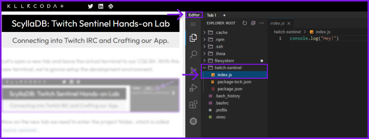
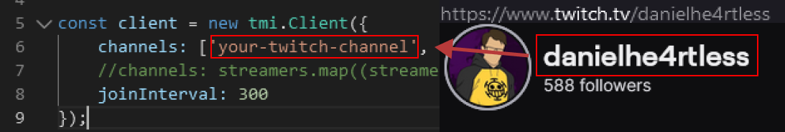

Let's open a new tab and leave the actual terminal to our CQLSH. Head to `Editor Tab` , we're gonna setup the development environment by downloading everything we need.



Now on the `Editor Tab` tab we need to enter the project folder, which is called `twitch-sentinel`. 

`cd twitch-sentinel`{{execute}}

After your terminal is also inside the project folder, we need to install the project dependencies. For this project we'll need only two:

- [ScyllaDB/Cassandra](https://www.npmjs.com/package/cassandra-driver) connector to NodeJS
- [tmi.js](https://tmijs.com/)(Twitch Chat Client). 


You can run the command below and install the dependencies: 

```sh
npm i tmi.js cassandra-driver
```{{execute}}

Now run the project with: 

```sh
node index.js
```

You can add your channel name into line 6 and send a few messages on your twitch chat to test it. 



If you want to see some real environemnt, comment the line 6 and uncomment the line 7 and it will load a small list of streamers that can be possibly online.

```js
const client = new tmi.Client({
    //channels: ['your-twitch-channel', 'danielhe4rt'],
    channels: streamers.map((streamer) => streamer.streamer_username),
    joinInterval: 300
});
```


## Understanding the code

To use ScyllaDB in any language, you will need to download any of our drivers OR can also be using a 3rd party driver from Cassandra. You can check the available drivers [here](https://docs.scylladb.com/stable/using-scylla/drivers/cql-drivers/index.html).

### Scylla Connection

In this example we used the `cassandra-driver` because we don't have a native driver for NodeJS yet. 

On the connector, we will need to provive all the information related to which datacenter we're about to store the application data.

```js
const cassandra = require('cassandra-driver');
const cluster = new cassandra.Client({
    contactPoints: ["172.17.0.2", "172.17.0.3", "172.17.0.4"],
    credentials: { username: 'scylla', password: 'secret-password'},
    localDataCenter: 'datacenter1',
    keyspace: 'twitch_sentinel'
})
```

* Since this application is running in a local environment, with Docker, the `localDataCenter` variable needs to be `datacenter1` that is used for this kind of situation. 
* Important the `contactPoints` refers to the node IP addresses setted on `Replication Factor`. In our case, we setted 3 nodes so it will be expecting 3 IP's.
* Your credentials depend on each environment you're running
    * **Docker:** username is `scylla` and the password can be anything.
    * **Scylla Cloud:** username is `scylla` and the password can be found in the `Instructions Tab`.
* `Keyspace` is optional since you can connect on CQLSH and create it by running a query, but sooner you have it set-up, better.

> Drivers in other languages may require `CONSISTENCY_LEVEL` to start but in this case, you can set it on a specific query.

### Twitch Connection

Connect into Twitch chat with NodeJS become way easier when you envolve `tmi.js`, a simple client to listen to any Twitch chat without using credentials.

Twitch Chat is an `IRC` boosted based chat, so if you have any familiarity with the protocol it will be easy to understand it.

But since were using TMI.js things are way less complicated. Let's check how to connect to their servers:

```js
const tmi = require('tmi.js');
const client = new tmi.Client({
    //channels: ['your-twitch-channel', 'danielhe4rt'],
    channels: streamers.map((streamer) => streamer.streamer_username),
    joinInterval: 300,
    //identity: {
	//	username: 'my_bot_name',
	//	password: 'oauth:my_bot_token'
	//},
});

client.connect();
client.on('message', (channel, user, message, self) => {
    console.log(`${channel} -> ${user['display-name']}: ${message}`);
});
```

* You will need to inform which `channels` can you want to connect. There's no limit for that, so you can explore multiple channels at the same time.
* There's a minimum `joinInterval` delimited by Twitch that is `300ms` but you can mail them and ask for permission for a minor interval.
* If you want to dig deeper, you can create your Twitch Dev account and do your own verified bot and fill the `identity credentials`.

> By default the TMI uses a "anonymous bot" that can only read chat messages.


The `user` object retrieved in any `client.on()` event:
```json
{
    "badge-info": {
        "subscriber": "58"
    },
    "badges": {
        "broadcaster": "1",
        "subscriber": "3036",
        "partner": "1"
    },
    "client-nonce": "3e00905ed814fb4d846e8b9ba6a9c1da",
    "color": "#8A2BE2",
    "display-name": "danielhe4rt",
    "emotes": null,
    "first-msg": false,
    "flags": null,
    "id": "b40513ae-efed-472b-9863-db34cf0baa98",
    "mod": false,
    "returning-chatter": false,
    "room-id": "227168488",
    "subscriber": true,
    "tmi-sent-ts": "1686770892358",
    "turbo": false,
    "user-id": "227168488",
    "user-type": null,
    "emotes-raw": null,
    "badge-info-raw": "subscriber/58",
    "badges-raw": "broadcaster/1,subscriber/3036,partner/1",
    "username": "danielhe4rt",
    "message-type": "chat"
}
```

### Querying Twitch to ScyllaDB

Initially we will do a single query just inserting the message into `messages table`. We will use the same example query showed on the previous step. 

On the database client, we have a function named `execute()`, which will receive the `prepared query` and the `binded parameters` for this query.

```js
async function insertOnDatabase(user, message) {
    message = escape(message);
    await cluster.execute(query, [
        let query = `INSERT INTO messages (streamer_id, chatter_id, chatter_username, chatter_message, message_sent_at) VALUES (?, ?, ?, ?, ?)`
        user['room-id'],
        user['user-id'],
        user['display-name'],
        message,
        parseInt(user['tmi-sent-ts'])
    ]);
}
```

Things to pay attention: 

* Verify if the amount of bindings fit the amount of columns.
* Partition Key and Clustering keys are `required` for each query in Scylla. Eg: streamer_id and message_sent_at
* By default, if you use `prepared statements` (as the example above), it will transform all the data for the right type based on your data modeling.
  * But for that, you need to respect the rules implied by the driver.

> If you want to insert a timestamp from a **String**, it will fail. Before insert it, you will need to transform to **Integer**. We strongly recommend you to always check your driver documentation.

And with that you have the base knowledge on what is going on at this sample code.